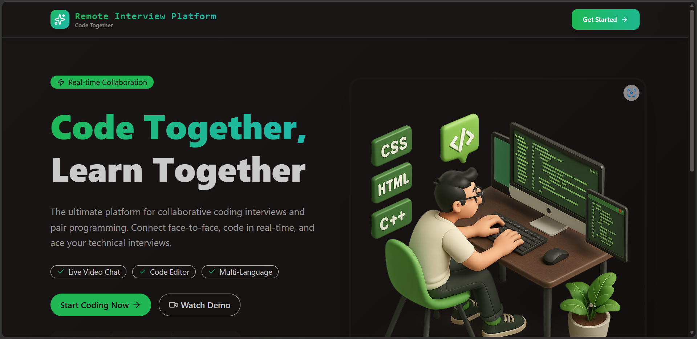
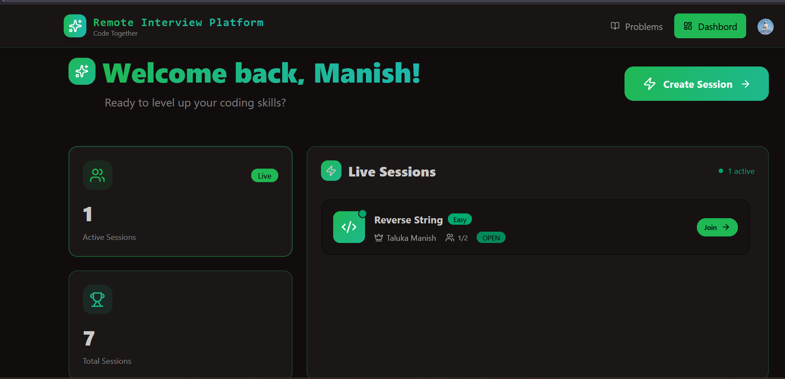
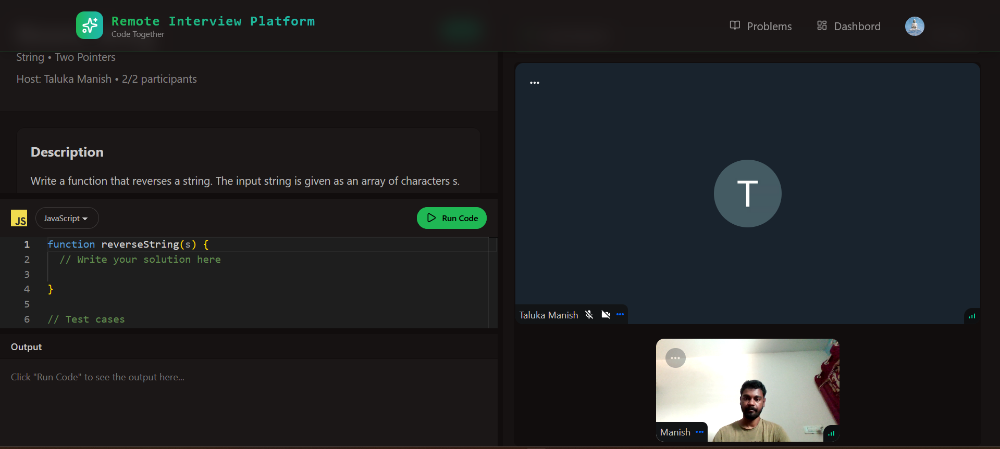
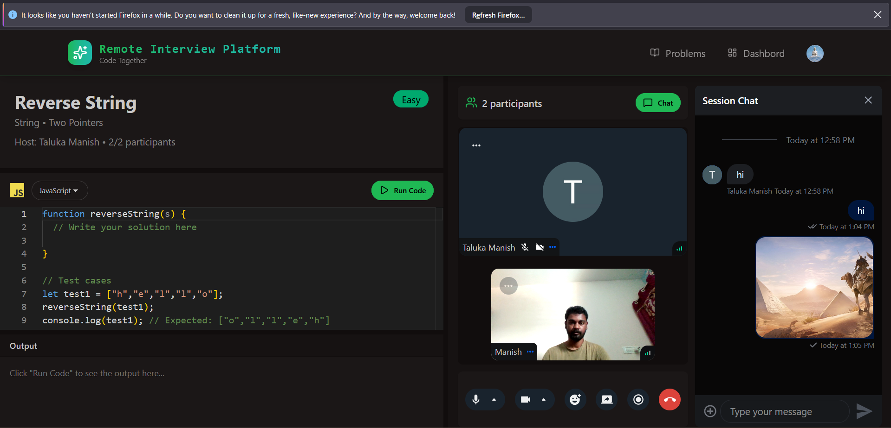
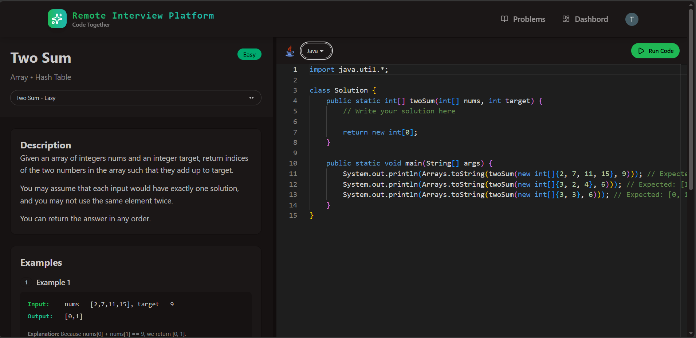

# ✨ Remote Interview Platform ✨


A real-time, full-stack interview platform built for seamless 1-on-1 technical interviews — featuring live video, collaborative coding, and instant session management.

✨ Highlights:

- 🎥 1-on-1 Video Interview Rooms (powered by Stream Video)
- 💬 Real-time Chat Messaging (powered by Stream Chat)
- 🧑‍💻 Live Collaborative Code Editor
- 🔐 Secure Session Management (Host & Candidate roles)
- 🔒 Room Locking — allows only 2 participants
- 🔊 Mic & Camera Toggle, Screen Sharing
- 🚪 Host-Controlled Session End
- 🔁 Rejoin Support — seamlessly re-enter an active session
- 🧰 REST API with Node.js & Express
- ⚡ React + Vite Frontend with fast HMR
- 🗄️ MongoDB for session persistence
- 🚀 Clean, minimal UI with Tailwind CSS

---

## 🧪 .env Setup

### Backend (`/backend`)

```
PORT=3000
NODE_ENV=development

DB_URL=your_mongodb_connection_url

INNGEST_EVENT_KEY=your_inngest_event_key
INNGEST_SIGNING_KEY=your_inngest_signing_key

STREAM_API_KEY=your_stream_api_key
STREAM_API_SECRET=your_stream_api_secret

CLERK_PUBLISHABLE_KEY=your_clerk_publishable_key
CLERK_SECRET_KEY=your_clerk_secret_key

CLIENT_URL=http://localhost:5173
```

### Frontend (`/frontend`)

```
VITE_CLERK_PUBLISHABLE_KEY=your_clerk_publishable_key

VITE_API_URL=http://localhost:3000/api

VITE_STREAM_API_KEY=your_stream_api_key
```

---

## 🔧 Run the Backend

```bash
cd backend
npm install
npm run dev
```

---

## 🔧 Run the Frontend

```bash
cd frontend
npm install
npm run dev
```

---

## 📸 Screenshots

### 🏠 Home


### 📊 Dashboard


### 🎥 Video Interview Room


### 💬 In-Interview Chat


### 🧑‍💻 Code Editor


---

## 🚀 Tech Stack

| Layer | Technology |
|---|---|
| Frontend | React, Vite, Tailwind CSS |
| Backend | Node.js, Express |
| Database | MongoDB |
| Video & Chat | Stream Video SDK, Stream Chat SDK |
| Real-time | WebSockets via Stream |

---

## 📌 Key Features Explained

### 🎥 Video Interview Rooms
Each session creates a dedicated video room via Stream Video SDK. Only the host and one candidate can join — the room is locked to 2 participants.

### 🚪 Host-Controlled End Session
Only the host can end an active session. When ended, the session is marked complete in the database and both participants are removed from the call.

### 🔁 Rejoin Support
If a participant accidentally disconnects, they can seamlessly rejoin an active session without creating a new one.

### 💬 Real-time Chat
In-interview messaging is powered by Stream Chat, scoped to the session channel for privacy.
